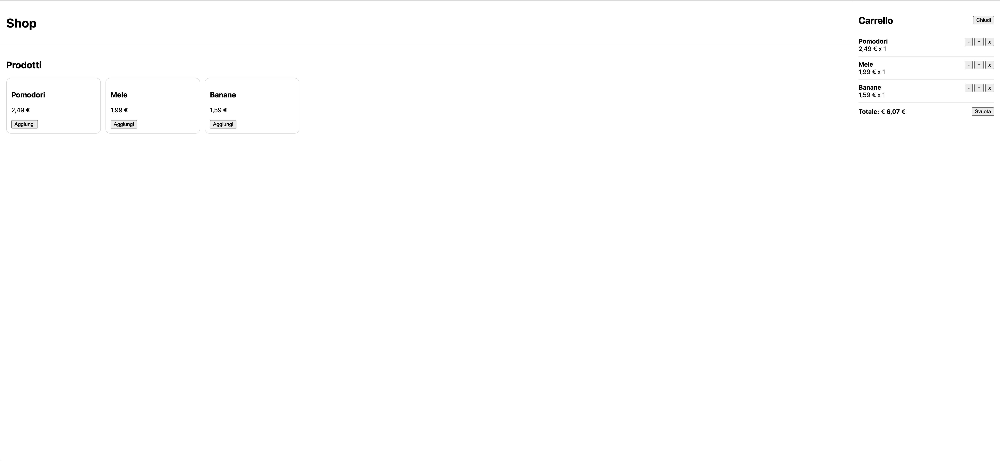

# JS Cart (LocalStorage)

🟢 **Live demo:** https://igorl-def.github.io/js-cart-localstorage/

Mini progetto portfolio: catalogo prodotti + carrello laterale con persistenza su LocalStorage.

## Funzionalità
- Aggiunta/rimozione prodotti dal carrello
- Gestione quantità (+ / -) e totale aggiornato
- Persistenza carrello con **LocalStorage**
- Carrello laterale (drawer) con apertura automatica

## Screenshot
 

## Tech stack
- HTML
- CSS
- JavaScript (Vanilla)
- Git + GitHub Pages

## Come avviarlo in locale
1. Clona il repo
2. Apri `index.html` nel browser

## Cosa ho praticato
- DOM manipulation ed eventi
- Gestione stato (carrello) in JavaScript
- LocalStorage (load/save)
- Struttura repo + deploy su GitHub Pages
